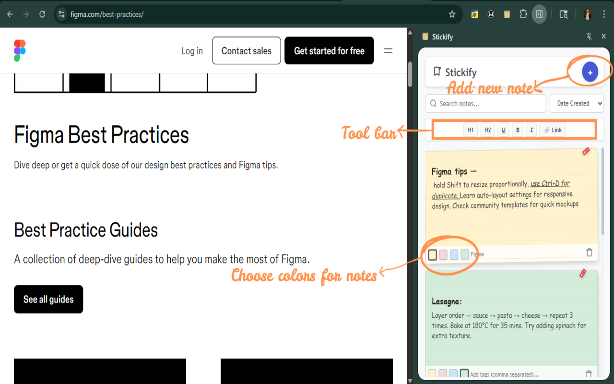
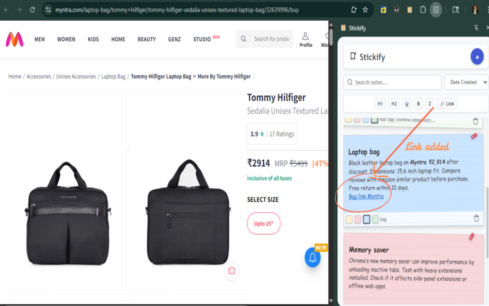
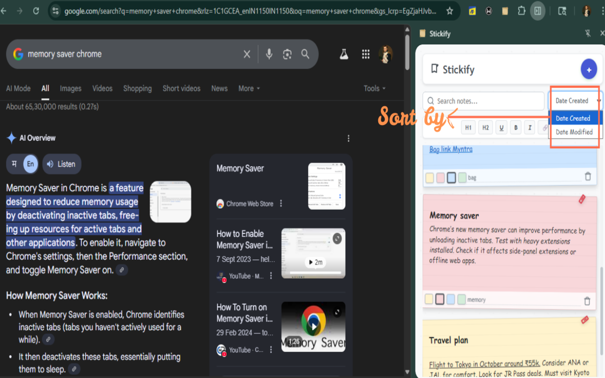
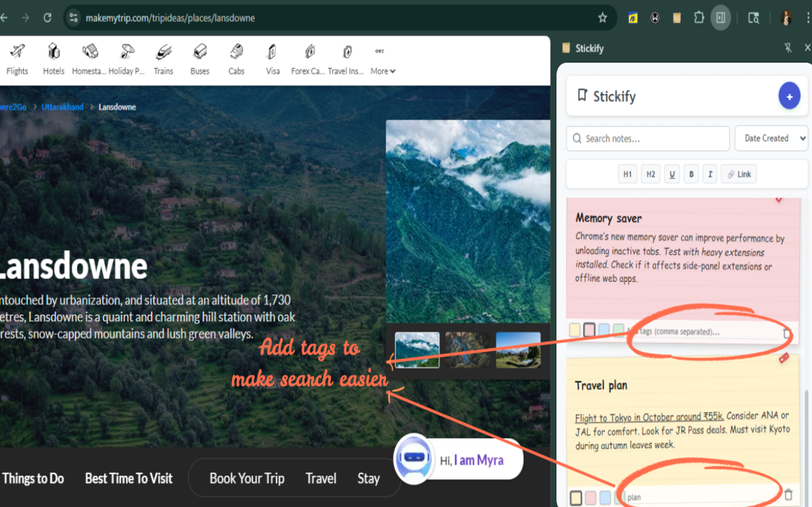
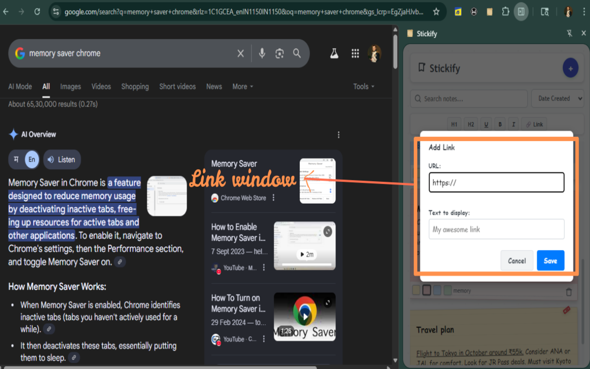

# Stickify 

A beautiful, simple, and feature-rich sticky notes companion for your browser. Built with security and privacy in mind, Stickify lives in your browser's side panel, ready to capture your thoughts on any webpage without getting in the way.

-----

##  Core Features

  * ** Rich Text Editing**: Go beyond plain text. Format your notes with **H1** and **H2** headings, **bold**, *italic*, \<u\>underline\</u\>, and even clickable 🔗 links.
  * ** Color-Coded Notes**: Organize your thoughts visually by choosing from four distinct note colors (yellow, pink, blue, and green).
  * ** Instant Search & Sort**: Quickly find the note you're looking for with a powerful search that looks through content and tags. Sort your notes by creation or modification date.
  * ** Tagging System**: Add comma-separated tags to each note for granular organization and filtering.
  * ** Secure & Private**: Your notes are **always stored locally** on your computer. Nothing is ever sent to a server. We use industry-standard tools to protect you from malicious content.
  * ** Modern UI**: Built with the latest Chrome Side Panel API, Stickify provides a seamless and integrated experience.
  * ** Intuitive Design**: A clean, polished interface with a fun, scrapbook-like feel that makes note-taking a delight.

##  Screenshots

-----

##  Tech Stack

  * **Manifest V3**: The latest, most secure standard for Chrome extensions.
  * **Vanilla JavaScript (ES6)**: No frameworks, just fast and efficient pure JavaScript.
  * **HTML5 & CSS3**: For the structure and beautiful, responsive styling.
  * **DOMPurify**: A robust XSS sanitizer to ensure that any content you paste into a note is safe.

-----

##  Installation

You can install this extension locally in any Chromium-based browser (like Chrome, Edge, or Brave).

1.  **Download:** Click the green `<> Code` button on the GitHub repository page and select `Download ZIP`.
2.  **Unzip:** Extract the `Stickify.zip` file to a permanent location on your computer.
3.  **Open Extensions Page:** In your browser, navigate to `chrome://extensions`.
4.  **Enable Developer Mode:** Turn on the "Developer mode" toggle, usually found in the top-right corner.
5.  **Load the Extension:** Click the `Load unpacked` button and select the `Stickify` folder that you unzipped earlier.

The Stickify icon will now appear in your browser's toolbar. Click it to open your new sticky notes panel\!

##  How to Use

1.  **Open Stickify**: Click the Stickify icon in your browser's toolbar to open the side panel.
2.  **Add a Note**: Click the `+` button in the header to create a new note.
3.  **Format Text**: While editing a note, highlight text and use the toolbar buttons (H1, B, I, U, etc.) to apply formatting.
4.  **Change Colors**: Use the color palette at the bottom of a note to change its background.
5.  **Add Tags**: Type comma-separated keywords in the tags input field at the bottom of a note.
6.  **Search**: Use the search bar at the top to instantly filter your notes by content or tags.

##  Our Commitment to Security & Privacy

We believe your data is your own. This extension was built from the ground up with that principle in mind.

  * **100% Local Storage**: All your notes and tags are saved directly in your browser's `localStorage`. They are never transmitted over the internet and are not accessible by any external service.
  * **Content Sanitization**: We use the trusted **DOMPurify** library to sanitize all note content on both save and render. This protects you from Cross-Site Scripting (XSS) attacks that could be hidden in copied content from other websites.
  * **Safe Link Handling**: The link insertion modal validates URLs and only permits `http://` and `https://` protocols, blocking potentially dangerous schemes like `javascript:`.
  * **Strict Content Security Policy (CSP)**: The extension's `manifest.json` defines a strict CSP (`script-src 'self'`), which prevents the extension from running unauthorized or external scripts, further hardening it against attacks.
  * **Minimal Permissions**: We only request `sidePanel` and `storage` permissions — the absolute minimum required for the extension to function.

##  Changelog

See [CHANGELOG.md](CHANGELOG.md) for a full history of changes across versions.

##  License

This project is open-source and available under the [MIT License](LICENSE).